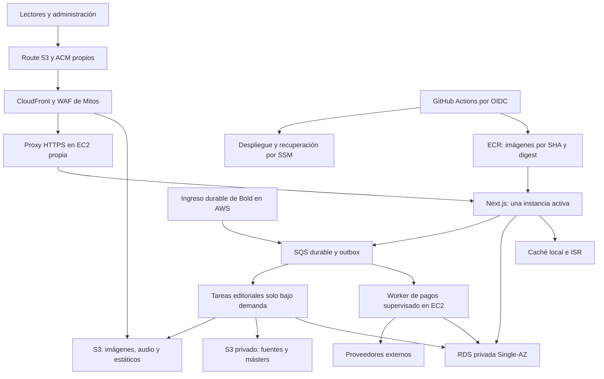

# Spec de migración completa de Mitos de Colombia a AWS

Fecha inicial: **30 de septiembre de 2026**, America/Bogota. Revisión económica: **1 de octubre de 2026**. Auditoría de lectura: 30 de septiembre por la noche; el recibo conserva la fecha UTC del 1 de octubre.

Estado: **implementación iniciada el 1 de octubre de 2026; primera etapa en curso, sin corte público**. El avance y las puertas pendientes están en [IMPLEMENTACION.md](IMPLEMENTACION.md). La arquitectura económica y la exclusión completa de IA siguen vigentes.

## 1. Resultado esperado

Mitos de Colombia operará en la cuenta **907264907058**, perfil local `colombiaprojects`, junto a RAG y Cocina, con infraestructura propia. El dominio público seguirá siendo **https://www.mitosdecolombia.com**, con sus URL, diseño y contenido conservados.

La migración estará completa cuando la web, API, administración, datos publicados y editoriales, archivos, narraciones, cuentas, pedidos, trabajos, secretos, respaldos y despliegues funcionen en destino; el taller tenga almacenamiento durable y herramientas conectadas a destino; y Vercel, Blob y Neon dejen de ser dependencias operativas de Mitos. Habrá evidencia de recuperación y de funcionamiento público, además del despliegue exitoso.

La propuesta predeterminada prioriza **infraestructura propia, costo fijo bajo y recuperación comprobada**, con una sola instancia de aplicación y RDS Single-AZ. Objetivo de planificación: **USD 60–80/mes de alojamiento**, más **USD 5–15 de pruebas temporales en meses con releases: USD 65–95/mes de infraestructura total** bajo ese uso. Todo presupuesto de IA queda excluido. Es una estimación bajo los supuestos de la sección 14, no un límite de facturación ni autorización de gasto. La primera propuesta de HA, USD 245–325/mes de alojamiento, queda solo como referencia histórica en [SPEC-HA-REFERENCIA.md](SPEC-HA-REFERENCIA.md).

### Requisitos verificables

| ID | Requisito | Evidencia de aceptación |
|---|---|---|
| R01 | Recursos propios en la cuenta destino | Inventario de ARN, cuenta, región, tags, dependencias y permisos; auditoría de aislamiento PASS. |
| R02 | Contenido completo, actual e histórico | Manifiesto del universo aprobado, conteos, claves, hashes, relaciones y archivos; diferencias justificadas y registradas. |
| R03 | Todas las funciones actuales conservadas | Matriz de rutas y flujos: lectura, búsqueda, mapa, tarot, contacto, comentarios, cuentas, administración y taller. |
| R04 | Despliegue automático por Git | Merge a `main` → imagen inmutable → validación → despliegue → comprobación pública → recibo. |
| R05 | Contenido rápido en móvil | Pruebas en condiciones definidas y medición real de LCP, INP, CLS, TTFB, imágenes, audio y caché. |
| R06 | Recuperación comprobada | Restauración a recursos nuevos, comparación y ensayo de rollback de aplicación. |
| R07 | Cero dependencia operativa de proveedores retirados | Inventario de consumidores, hosts, credenciales y llamadas; bloqueos de prueba y período de observación. |
| R08 | Comercio e identidad preservados | Contraseñas hash, sesiones válidas, pedidos, firmas, importes, estados y marcadores de conversión íntegros. |
| R09 | Continuidad SEO y analítica | URL, redirecciones, canonical, sitemap, robots, metadatos, GA4/GTM y consentimiento verificados. |
| R10 | Taller completo y recuperable | Archivo de fuentes, freezes, selecciones, binarios necesarios, ramas y cambios locales; ensayo de recuperación. |

No se cambia el corpus, la dirección artística, el estado comercial ni el proveedor creativo por migrar. OpenAI, ElevenLabs, Bold, Google, búsqueda web y cartografía siguen siendo integraciones externas donde hoy cumplen esa función. «Completo en AWS» se refiere al alojamiento, persistencia y operación propios; no exige sustituir esos productos.

## 2. Diagnóstico y límites de la evidencia

Se leyeron `ESTADO.md`, las instrucciones del repo, la configuración de Next, el Dockerfile, acceso a datos, caché, almacenamiento, autenticación, pedidos, webhook, scripts de audio y documentación del taller. Se consultaron STS, servicios y bases de RAG/Cocina, CloudFront, Route 53, disponibilidad de PostgreSQL y el catálogo público de precios. Todas las consultas externas fueron de lectura; las consultas SQL se hicieron dentro de `BEGIN READ ONLY`.

Los recibos están en [inventario-lectura.json](inventario-lectura.json), [fuentes-locales.json](fuentes-locales.json), [precios-economico.json](precios-economico.json) y el catálogo de la propuesta anterior [precios-catalogo.json](precios-catalogo.json). El inventario local se obtuvo con `.env` y `.env.local`; **P0 debe confirmar que corresponde al proyecto/branch y configuración efectivamente publicados en Vercel**. No se exportaron secretos ni filas con datos personales.

| Componente | Observado | Consecuencia |
|---|---|---|
| Aplicación | Next **16.2.10 declarado**, React 19; producción pública en Vercel | Se conserva Next; la referencia a Next 15 en instrucciones antiguas no dimensiona esta migración. |
| Repositorio | `alejingutierrez/mitos_colombia`, rama local `main`, muchos cambios vivos | La migración se implementará en rama/worktree aislado; no se desplegará el disco local completo. |
| CI/CD de Mitos | Sin archivos bajo `.github` en el árbol inspeccionado | Crear pipeline propio, no asumir que ya existe uno de AWS. |
| Base accesible | Neon PostgreSQL **17.11**, 59.072.512 bytes, 27 tablas | Usar la base viva; no reconstruir desde Excel ni SQLite históricos. |
| Catálogo | 596 filas en `myths`; 596 en `editorial_myths`; 51 comunidades, 6 regiones, 1.108 tags | Congelar el denominador al ejecutar; no usar los conteos antiguos de documentación como manifiesto final. |
| Medios estructurados | 1.260 `vertical_images`, 78 cartas, 5 banners, 182 narraciones, 143 lechos | Migrar todas las variantes y dependencias, incluidos tiempos de palabras, másters y asociaciones. |
| Comercio y participación | 6 usuarios, 6 sesiones, 1 pedido, 2 comentarios, 4 contactos | Conservar registros y estados sin revelar datos ni activar venta por migrar. |
| SEO | 746 filas `seo_pages` | Preservar payloads y referencias, además de las páginas renderizadas. |
| Blob accesible | **5.701 objetos**, **9.236.150.891 bytes**, 6 páginas de inventario | Copiar bytes existentes e historial; no volver a generar imágenes o audio. |
| Blob por familia | 2.100 mitos, 1.351 verticales, 652 cuadrados, 663 narraciones, 604 recibos históricos; además banners, tarot y otros | Los objetos que ya no salen en una página pueden sostener restauraciones o freezes. |
| Workspace | `content/` 5,2 GB, `output/` 9,7 GB, `artifacts/` 1,8 GB, `public/` 100 MB | Inventario por archivo y hash; estos tamaños se solapan conceptualmente y no sustituyen deduplicación. |
| RAG en destino | App Runner `rag-master`, `RUNNING`, `us-east-1`; RDS privada en VPC `vpc-0037b9506edf78e25` | Su servicio, red, DB y CloudFront quedan fuera del alcance de cambios. |
| Cocina en destino | Dos App Runner `RUNNING`, `us-east-2`; RDS privada en VPC `vpc-01c0681a4e1b125cb` | Tampoco se reutilizan ni se modifican sus recursos. |
| DNS destino | No apareció zona Route 53 con `mitos` en la consulta delimitada | Falta comprobar autoridad DNS, registrador y registros completos. |

### Hallazgos que cambian el diseño

1. **`@vercel/postgres` no es un cliente TCP genérico de RDS.** El paquete instalado usa `@neondatabase/serverless` y transporte Neon. Hay que sustituir el adaptador por `pg`, promover `pg` a dependencia de runtime y adaptar también los scripts. Cambiar únicamente el connection string no basta.
2. Se encontraron **41 archivos** con importación de Blob y **12** con importación de Postgres de Vercel bajo `src/` y `scripts/`. La eliminación de dependencia se comprobará por consumidores, no solo por `src/lib/db.js`.
3. El webhook Bold devuelve 200 y procesa con `after()`. Antes del corte necesita una recepción durable: un reinicio o deploy no debe perder un pago reconocido como recibido.
4. La autenticación limita intentos con un `Map` por proceso. Los reinicios y los dos procesos temporales de un deploy requieren límites durables y una política de IP de cliente fiable.
5. `assertBedrockConfigured` acepta claves/perfiles/bearer pero no reconoce por sí solo los roles de instancia/tarea como configuración válida. Hay que habilitar y verificar la cadena de credenciales de runtime; no trasladar un bearer que pueda facturar en otra cuenta.
6. La caché actual usa `unstable_cache`, tags y revalidación. La conmutación entre procesos durante deploy requiere invalidación y versiones coherentes; varios servidores activos requerirían coordinación adicional.
7. La base contiene seis tablas sin consumidores encontrados en el código inspeccionado: `analysis_results`, `backlinks_checks`, `backlinks_messages`, `backlinks_prospects`, `insights`, `news_articles`. **Su propiedad está pendiente; no se autoriza copiar, congelar ni eliminar esas tablas por asociación con el mismo endpoint.**
8. El Dockerfile actual hace `npm install`, copia el árbol y no usa salida standalone; `.dockerignore` no excluye `content/`. Su imagen no es el artefacto de producción propuesto.
9. `docs/deploy-vercel.md` incluye un seed de arranque. Es documentación histórica; su importador destructivo está prohibido en esta migración.

Las sondas públicas dieron 200 en `/`, `/mitos`, `/tarot`, sitemap y robots. `/api/taxonomy` agotó el tiempo de una sonda y debe repetirse en P0; no se diagnostica un fallo permanente con ese resultado. Los tiempos del recibo son de una sola petición desde la máquina auditora, **no una línea base de rendimiento colombiano ni una revisión visual**.

## 3. Decisiones de arquitectura

**Recomendación revisada: una EC2 `t4g.small` propia + RDS PostgreSQL `db.t4g.micro` privada Single-AZ + S3/CloudFront.** Región `us-east-1`, VPC y recursos propios; sin NAT Gateway, ALB ni Redis administrado permanentes. Antes de fijar subredes se elegirá CIDR sin solapamiento con las redes existentes.

La capacidad se apoya en los datos observados —base de unos 59 MB y medios servidos desde CDN—; el tamaño del corpus no revela por sí solo el tráfico. P0 mide tráfico y P5 prueba carga. El tamaño económico solo se acepta si pasa esos controles. La aplicación conserva sus funciones y su contenido completo.

| Decisión | Motivo |
|---|---|
| Una EC2 de 2 vCPU/2 GiB, ARM64 | Aproximadamente USD 12,26/mes de cómputo; build fuera del servidor y tareas pesadas fuera del proceso web. |
| RDS micro privada, una AZ | Aproximadamente USD 13,98/mes con 20 GiB; backups/PITR administrados y datos separados de la aplicación. |
| S3 + CloudFront | Imágenes, audio y estáticos no consumen RAM ni CPU del servidor en cada visita. |
| Caché local persistible e ISR | Una instancia activa no necesita Redis compartido; invalidación y coherencia durante deploys se prueban explícitamente. |
| Una IP pública y acceso al origen restringido | Permite llamar a proveedores y AWS sin pagar NAT ni balanceador; no se abre RDS a Internet. |
| SQS y procesos de trabajo independientes | Recepción durable de pagos y trabajo recuperable; el worker de pagos ligero corre como servicio supervisado en la misma EC2. |
| Staging temporal | Validación antes de promover sin mantener una segunda instalación todo el mes. |

**Compromiso de costo:** no hay servidor de reserva ni standby de base de datos. Un fallo de servidor/AZ o una recuperación de RDS puede interrumpir las funciones dinámicas; los archivos ya entregados por S3/CDN siguen disponibles. Se ensayan recuperación y rollback. La actualización a varias réplicas/Multi-AZ se justifica después por tráfico o disponibilidad requeridos, con un presupuesto nuevo.

EC2 requiere operación del sistema: AMI/OS soportados, parcheo por Systems Manager, rotación de imágenes base y recreación declarativa. Es trabajo de mantenimiento, aunque no sea un cargo adicional de IA. La alternativa administrada ECS Fargate + ALB se conserva como opción de crecimiento; no se factura por defecto su capacidad permanente. App Runner tampoco se elige como base nueva por la [orientación actual de AWS](https://aws.amazon.com/apprunner/).

## 4. Recursos y aislamiento

Prefijo lógico `mitos-colombia`; entornos `prod` y `staging`. Tags obligatorios: `Project=mitos-colombia`, `Environment`, `ManagedBy=CloudFormation`, `Owner` y `CostCenter`. No se buscará una DB/VPC por nombres ambiguos ni se usará la primera de una lista como fallback.

| Recurso | Configuración inicial económica |
|---|---|
| VPC | Propia; subredes públicas de aplicación y privadas aisladas de datos en dos AZ para el DB subnet group. RDS activa en una AZ. |
| Aplicación | EC2 `t4g.small` Linux ARM64, 2 vCPU/2 GiB, EBS gp3 30 GiB cifrado; un servidor activo. Launch template y recreación propia, sin reserva encendida. |
| Entrada | HTTPS mediante Caddy o Nginx, IP/host de origen estable; SG de 443 limitado a la prefix list de CloudFront y cabecera secreta de origen propia que se valida en el proxy. Sin puertos públicos para Next/DB ni SSH abierto. |
| TLS | ACM para viewer; certificado público válido en el origen con renovación DNS-01 automática y permisos Route 53 acotados a su challenge. Probar SNI, Host y renovación. |
| Salida | Internet Gateway e IP pública de la aplicación; salida HTTPS directa. Gateway endpoint S3 propio si corresponde. **Cero NAT Gateway, ALB y VPC Interface Endpoints permanentes.** |
| RDS | PostgreSQL 17.11, `db.t4g.micro`, 20 GiB gp3, Single-AZ, privada, cifrada, protección de borrado y PITR. SG solo acepta aplicación/tareas/puente propios. |
| Caché | ISR/caché de la instancia; directorio persistible y namespaces por release. Sin ElastiCache. La caché se puede perder y reconstruir sin pérdida de contenido. |
| ECR | Imágenes web/worker propias y tags SHA inmutables; comprobar ARM64 y dependencias nativas. Build en CI, no en la EC2 de producción. |
| Archivos | Tres buckets versionados: derivados/estáticos, archivo privado, operación/respaldos. Block Public Access en todos; publicación por OAC de CloudFront. |
| Colas y pagos | SQS y DLQ; ingreso HTTP API/Lambda fuera de VPC para persistir callbacks. Worker ligero en EC2 accede a RDS por red privada y a Bold por su salida directa. |
| Trabajo largo | ECS/Fargate RunTask público con SG propio e IP temporal solo durante el trabajo; sin tráfico de entrada. No instalar render/generación pesados en el servidor web. |
| Configuración | Secrets Manager/SSM y roles propios. IMDSv2 obligatorio, permisos de instancia y tareas limitados al proyecto; credenciales no copiadas a la imagen. |
| Edge/DNS | CloudFront web/media propios, inicialmente pago por uso con políticas precisas; comprobar si un único plan Pro con media bajo `/media/` admite todos los comportamientos y variantes necesarias. |
| Observación | Logs breves, alarmas de salud/RAM/disco/CPU/créditos y estado de pagos; evitar dashboards y métricas de alta cardinalidad sin necesidad. |
| Staging | Recursos propios temporales y fixtures; crear para ensayo/release y retirar al terminar, conservando recibos y snapshots necesarios. |

CloudFront y S3 mantienen el CDN. El origen EC2 es direccionable públicamente, pero solo admite tráfico de CloudFront más el secreto de la distribución; ese secreto no llega al navegador y se rota. SSM administra la instancia sin SSH público. La configuración HTTPS y la restricción al origen siguen el [patrón de cabecera y prefix list documentado por AWS](https://docs.aws.amazon.com/AmazonCloudFront/latest/DeveloperGuide/restrict-access-to-load-balancer.html), aplicado al proxy de EC2 en vez de a un listener ALB.

La recuperación conserva/reasocia el endpoint público y arranca la imagen estable desde IaC/SSM, con comprobación de readiness antes de admitir tráfico. No se declara un failover de AZ de la DB: es Single-AZ y requiere recuperación/restore si falla. Los secretos y certificados no pueden existir únicamente en el disco perdido.

Se pueden utilizar el proveedor OIDC y servicios generales de cuenta existentes; **roles, policies, ejecución, datos y despliegue serán de Mitos**. Las cuotas AWS por cuenta/región siguen compartidas; se fijan límites propios sin reducir reservas de RAG/Cocina.

IaC: CloudFormation con stacks propios de red, datos, storage, runtime/jobs y edge/observación. Retain/protección donde hay datos. El rol CI solo opera stacks, roles, buckets e instancias propios, con `iam:PassRole` y SSM SendCommand acotados; no puede usar recursos de RAG/Cocina. Parches de OS/AMI se prueban en la instalación temporal y el reemplazo se ensaya, sin modificaciones manuales irreproducibles.

## 5. Universo de datos y migración Postgres

### Tablas candidatas de Mitos

| Grupo | Tablas |
|---|---|
| Catálogo y relaciones | `myths`, `regions`, `communities`, `tags`, `myth_tags`, `myth_keywords` |
| Dossiers/editorial | `editorial_myths`, `editorial_myth_tags`, `editorial_myth_keywords`, `editorial_myth_research` |
| Medios | `vertical_images`, `tarot_cards`, `home_banners`, `myth_narrations`, `narration_beds` |
| SEO/participación | `seo_pages`, `comments`, `contact_messages` |
| Comercio | `tarot_users`, `tarot_user_sessions`, `tarot_orders` |

Son **21 tablas candidatas**, no una allowlist definitiva. P0 confirmará propietarios, dependencias, vistas, secuencias, constraints, índices, triggers, funciones y consumidores externos. Clasificará las otras seis tablas con evidencia. Si alguna también pertenece a Mitos se incorpora expresamente al manifiesto; si es ajena permanece en origen. No se congela la base compartida completa ni se retira el proyecto Neon completo sin esa clasificación.

### Método predeterminado

Dado el tamaño lógico observado, usar **`pg_dump`/`pg_restore` de PostgreSQL 17** desde una tarea de migración propia en AWS, con un ensayo previo. El dump seleccionará el universo aprobado e incluirá las dependencias verificadas; no se asumirá que `--table` exporta por sí solo todos los objetos necesarios. Los roles propietarios de Neon se mapearán a roles de Mitos, sin importar privilegios de proveedor ni superusuario.

La pausa propuesta afecta escrituras: hasta **15 minutos**, sujeta al tiempo del ensayo. La lectura continuará en la instalación antigua mientras se hace la copia final. Si la pausa medida excede el límite acordado, la puerta de corte permanece cerrada y se adopta replicación lógica/CDC después de validar permisos, replica identity, slots, DDL y secuencias. No añadir DMS permanente a una DB de este tamaño por defecto. Fuentes: [métodos nativos de migración a RDS](https://docs.aws.amazon.com/dms/latest/sbs/chap-manageddatabases.postgresql-rds-postgresql-full-load.html) y [replicación saliente de Neon](https://neon.com/blog/stream-data-from-neon-to-external-data-sources-via-logical-replication).

Procedimiento: inventario → respaldo cifrado → restauración de ensayo a DB nueva → validación → freeze de escritores propios → copia final consistente → comparación → cambio de writer → apertura. Los procesos locales, editoriales, API, administración y automatizaciones están incluidos como escritores. Registrar `T_freeze`, `T_cutover` y `T_retired` en UTC y hora local.

Preservar IDs, slugs, textos, fuentes, prompts, fechas, coordenadas, arrays/JSON, timings, hash de audio, hashes de contraseñas, sesiones, referencias e importes de pedidos. Comprobar secuencias al final, constraints y relaciones, incluso las referencias de `vertical_images`/`tarot_cards` que no tengan FK. Cambiar URLs solo mediante el mapa de activos versionado, con diff reversible y sin alterar el contenido editorial.

La comparación tendrá conteos por tabla, claves ordenadas, digest de filas con serialización definida, esquema y relaciones. El corte exige **cero diferencias inexplicadas**. Los archivos de comparación no publicarán emails, direcciones, tokens, hashes de contraseñas ni cuerpos de pedidos.

**Prohibido:** `npm run db:import:pg`, reseed de Excel, truncates, una copia antigua `mitos.db`, regeneración de contenido y sincronización destructiva del catálogo. Migraciones posteriores: versionadas, una sola ejecución por release, lock y registro; modelo expand/contract. Sacar los `CREATE/ALTER` dispersos de las rutas hacia migraciones controladas y quitar permisos DDL al runtime.

Acceso a RDS con `pg.Pool` y TLS verificado con CA RDS. Roles separados para aplicación, trabajo, migración y recuperación. Pool inicial máximo 5 conexiones por proceso web; contemplar los dos procesos temporales durante deploy, worker y tareas para un budget inicial de unas 20 conexiones, sujeto a `max_connections` real. Reservar margen administrativo, medir RAM/CPU/créditos de RDS y probar reconexión tras reinicio/restore. No introducir RDS Proxy sin medir una necesidad.

## 6. Medios, archivo y taller

Inventario final será la **unión** de referencias de BD, `public/`, Blob completo, fuentes, manifests, freezes, selecciones, recibos y binarios únicos de `content/`, `output/` y `artifacts/`. Resolver duplicados por SHA-256 sin perder nombres, relaciones ni procedencia. Un ETag no sustituye el hash de contenido.

| Destino | Material | Acceso |
|---|---|---|
| S3 derivados/estáticos | Imágenes publicadas, variantes web, MP3, fuentes tipográficas, iconos, motivos y archivos de runtime | OAC + CloudFront; publicación explícita por prefijo. |
| S3 archivo privado | Másters, WAV, fuentes de investigación, guiones, biblias, keyframes, preparados, freezes y material con derechos | Roles de taller/worker; URLs firmadas breves cuando hagan falta. |
| S3 operación | Dumps, bundles Git, overlays de trabajo, evidencias, paquetes de build y recibos | Privado, cifrado, roles de despliegue/recuperación. |

La clasificación conserva el acceso que necesitan los consumidores; un recurso hoy usado públicamente no se vuelve privado sin adaptar y comprobar sus consumidores. Los objetos de `triptych-history` se preservan íntegros. Los derechos de investigación no cambian: lo privado no se publica por haberlo copiado a AWS.

Crear `asset-map` con URL original, objeto/version origen disponible, clave/version destino, tamaño, MIME, SHA-256, dimensiones/duración, rol editorial y permisos. Copia reanudable, con checkpoints, reintentos y verificación de cada objeto. El manifiesto completo y los dumps estarán en S3 privado; el repo guardará resúmenes/recibos sin datos sensibles.

**Nunca modificar `freeze.json` ni una carpeta `prepared-NN` histórica.** El mapa externo resolverá sus URL antiguas a bytes equivalentes en AWS cuando el taller lea o reproduzca una edición. Preparaciones nuevas usarán recursos de AWS y una nueva carpeta. No se pierden semilla, prompt, proveedor, imagen de referencia, selección o hashes.

Preservar ramas sin fusionar y cambios locales mediante bundles y overlays sin secretos; inventariar worktrees sin borrarlos. La prueba de recuperación reconstruirá un mito con sus fuentes y una edición de diez láminas desde lo archivado, **sin volver a pagar generación**. Los binarios que costaron créditos y no existen en otro respaldo se conservan aunque hoy estén ignorados por Git. `output/`, `artifacts/` y `.mp4` no se incorporan a Git por esta migración.

El estudio vigente `/design-system/instagram-story` mantiene el flujo local, tipografías/paleta, diez láminas, variantes, QA y prepares inmutables. No se publica el editor local ni se meten sus 5 GB de fuentes dentro del contenedor web. AWS almacenará y ejecutará las tareas apropiadas; el workspace sigue siendo una herramienta de edición, conectado a almacenamiento destino con perfil/rol propio y descargas por manifiesto. La imagen del worker fija las versiones de FFmpeg, ImageMagick, Playwright/Chromium y fuentes que requieran los scripts; su QA compara renders y audio, y el contenedor web no carga esas herramientas ni comparte con ellas la RAM del servidor durante render pesado.

Los hosts de Blob no son transferibles al dominio propio. Se actualizarán referencias operativas a **`media.mitosdecolombia.com`** y se conservará el origen durante una ventana de compatibilidad medida. Las referencias históricas inmutables se resolverán con el mapa. Antes de retirar Blob se comprobarán enlaces vivos conocidos y dependencias; no se promete redirigir un hostname que controla Vercel.

## 7. Cambios necesarios en la aplicación

| Superficie | Cambio requerido |
|---|---|
| `src/lib/db.js` y scripts Postgres | Adaptador `pg`; interfaz de queries/transactions coherente; SQLite solo local/build controlado; producción falla explícitamente si falta DB. |
| Generación/ingesta/auditoría Blob | Adaptador de storage S3 para put/get/list/delete/presign; URLs propias; borrado limitado a objetos/versiones y propiedad aprobados. |
| `next.config.js` | Standalone, hosts media propios, caché local/ISR e ID de despliegue; conservar AVIF/WebP y excluir taller. |
| Docker/lockfile | Imagen multietapa con `npm ci`, runtime no-root y Node LTS soportado elegido en implementación; dependencias nativas verificadas. |
| Caché/revalidación | Invalidación del proceso activo y del candidato durante deploy + purga CDN donde haya edge cache; namespaces por release/revisión. |
| API admin larga | Aceptar trabajo y devolver ID; progreso persistido, reintentos y cancelación; no depender del proceso web durante generaciones. |
| Autenticación | Mantener cookie/hash/sesión y UX; WAF por IP y contador durable por cuenta en DB para sobrevivir reinicios; validar Host/Origin/IP; sin defaults `admin/admin` en producción. |
| Bedrock | Credenciales por rol de instancia/tarea, cuenta/región verificadas y perfil propio; eliminar prioridad silenciosa de credenciales ajenas. Su consumo no integra este presupuesto. |
| SEO/configuración | URL pública explícita; no derivar canonical de hostname interno ni de `VERCEL_URL`. |
| Operación | `/api/health/live`, `/api/health/ready` y endpoint de versión sin secretos con SHA/digest/esquema. |

El build no tendrá credenciales productivas ni acceso público a RDS. Se preparará un **snapshot de datos publicados, sin datos personales**, para las lecturas requeridas por prerender/`generateStaticParams`; CI obtiene solo ese objeto/prefijo. El snapshot lleva versión/digest, se incorpora únicamente a la fase build y nunca es fallback de producción. Si el ensayo demuestra que una ruta debe generarse al primer acceso, se ajusta esa ruta y se precalienta; no se vuelve dinámica toda la web para resolver el pipeline.

`NEXT_PUBLIC_*` se fijan al construir. El artefacto promovido tendrá las mismas constantes públicas; staging debe desactivar analítica y proveedores reales con configuración de servidor, sin recompilar silenciosamente al promover. La imagen no contiene `.env`, credenciales AWS, SQLite de respaldo ni carpetas de producción visual. Configuración de arranque, permisos y perfil local rechazan cuentas/regiones diferentes a las esperadas; desarrollo accede a la DB privada mediante tareas propias o un túnel SSM temporal, nunca abriendo RDS a Internet.

Usar build único, `deploymentId` por SHA y la misma clave de Server Actions si se usan. Retener assets de releases anteriores para sesiones abiertas. La caché local tendrá TTL, límite de disco/memoria, namespaces por release y revisión, invalidación verificable y protección frente a estampidas. Durante la conmutación temporal se invalidan ambos procesos; después queda uno activo. Perder la caché deriva a lectura limitada de RDS, sin responder contenido vacío ni contaminar versiones. Redis compartido se añade solo si después se aprueban varias instancias activas. Referencia: [self-hosting y coordinación de instancias en Next.js](https://nextjs.org/docs/app/guides/self-hosting), contrastada con la guía instalada en `node_modules/next/dist/docs/`.

## 8. Contenido rápido y política de caché

Velocidad es un requisito medible. Copiar la web a otra nube no garantiza mejorarla: la arquitectura y los bytes entregados se probarán.

| Tráfico | Origen/política inicial |
|---|---|
| JS/CSS con hash | S3 + CloudFront; un año `immutable`; publicados antes de admitir la nueva imagen. Prefijo de release y retención de anteriores. |
| Imágenes web | S3 + CDN; derivados existentes/nuevos por tamaño, AVIF/WebP, `srcset`/`sizes`, dimensiones explícitas; nombres inmutables. |
| MP3 público | S3 + CDN; Range/206 y seek verificados; `preload=none/metadata`; no descargar WAV al lector. |
| HTML público | ISR/caché local de la instancia. Edge se habilita por whitelist después de pasar las pruebas HTML/RSC; TTL máximo inicial 60 s donde la ruta sea pública/cacheable. |
| API pública de catálogo | Cache solo para GET anónimo aprobado; clave conserva filtros, paginación y orden; TTL por frescura. |
| Búsqueda/mapa dinámicos | Query completa, límites y paginación; por defecto sin edge cache hasta medir cardinalidad. |
| Cuenta, checkout, pedidos, contacto, comentarios POST, admin, webhooks | Caché deshabilitada, `private/no-store`, TTL mínimo 0; cookies/auth/body encaminados sin reutilización entre usuarios. |
| Sitemap/robots | TTL corto y purga tras publicación; URL y visibilidad coherentes con el catálogo. |

CloudFront no debe asumir que `Vary` basta: conservar `_rsc` en la clave, los headers RSC/prefetch/router relevantes y los parámetros reales de cada ruta. Probar navegación cliente, prefetch y entrada directa en órdenes alternadas. No aplicar TTL mínimo positivo a rutas privadas ni guardar respuestas con `Set-Cookie`. La invalidación de Next por sí sola **no purga el CDN**; se invalidarán HTML y variantes RSC mediante evento/outbox con reintentos. Fuente: [CDN Caching de Next.js](https://nextjs.org/docs/app/guides/cdn-caching).

`/_next/image` requiere política por `url`, `w`, `q` y negociación de formato; no mezclar AVIF/WebP. La transición puede mantener el optimizador Next detrás de CDN. La salida preferida para medios publicados es generar variantes al ingerir, nunca bajo demanda en cada visita; ese cambio solo se adopta cuando preserve proporciones, foco y calidad del arte.

### Objetivos iniciales

| Métrica | Objetivo de aceptación |
|---|---|
| Disponibilidad de lectura | Objetivo de seguimiento 99,9 % mensual, sin garantía de HA; medir caídas/recreación del servidor y DB Single-AZ. El corte exige aceptar los tiempos reales de recuperación. |
| LCP móvil p75 | ≤ 2,5 s; muestra real suficiente después del corte. |
| INP móvil p75 / CLS | ≤ 200 ms / ≤ 0,1. |
| TTFB p95 | ≤ 300 ms para rutas públicas calientes aptas para edge; ≤ 800 ms para GET dinámico sin invocación IA, bajo carga acordada. |
| Imagen hero móvil | Presupuesto orientativo ≤ 300 KB y primera pantalla total ≤ 1 MB transferido, con excepciones artísticas medidas. |
| Caché estática/media | Hit ratio ≥ 95 % tras calentamiento de la prueba, reportado por familia. |
| Publicación | Cambio confirmado visible en el proceso activo/CDN en ≤ 120 s; candidato de deploy coherente antes de conmutar. |
| Audio | Inicio ≤ 1,5 s en red de prueba, seek funciona y no hay descarga de máster en la página. |

P0 obtiene línea base repetida desde Colombia, escritorio y móvil con viewport 390 px, red/CPU normalizadas y mismas rutas/medios. P5 prueba 25 req/s sostenidas 15 minutos y una ráfaga 75 req/s 2 minutos con mezcla de lectura, búsqueda y variantes; revisar contra tráfico real para no sobredimensionar. Menos de 0,5 % errores técnicos, sin timeouts generalizados, datos personales cruzados ni desbordamiento de conexiones. El sitio no debe empeorar más de 10 % frente a la línea base comparable; cada excepción queda documentada. Los objetivos de campo necesitan una ventana y tamaño de muestra: no se declaran alcanzados con Lighthouse solamente.

## 9. Pagos, trabajos y servicios externos

### Recepción durable de Bold

Flujo: cuerpo crudo → firma verificada → evento persistido/encolado → 2xx → worker → consulta de comprobante Bold → validación de referencia, moneda e importe → actualización transaccional → conversión según estado y marcadores existentes.

La persistencia precede al 2xx. Clave de deduplicación por proveedor/evento o hash estable, constraint en DB, protección frente a eventos repetidos/desordenados, reintentos exponenciales y DLQ. Los `VOID_*` se conservan. Si el comprobante todavía no existe, el trabajo se reprograma; no se convierte en rechazo ni desaparece. El cambio de estado comercial será idempotente; las llamadas externas no se describen como «exactamente una vez» por una garantía de SQS.

Para el corte habrá una recepción AWS propia provisional —HTTP API/Lambda de ingreso o equivalente— que ambos frontends puedan usar reenviando cuerpo y firma intactos. Se prueba y concilia antes del freeze. Mientras se copia la DB, se pausa procesamiento, no recepción; después de abrir RDS se drenan eventos. Así los callbacks que todavía lleguen a Vercel durante propagación DNS no se pierden. La vía provisional se retira cuando expire la compatibilidad.

Conservar flags y entorno real observado. Staging usa Bold test y datos sintéticos; no abre ventas, cobra, devuelve dinero ni emite conversiones productivas como parte de QA. Los marcadores de GA4 de pedidos existentes impiden reenviar compras históricas. Probar firma incorrecta, duplicado, monto incorrecto, demora, anulación, reinicio del proceso y deploy durante procesamiento.

### Taller y generación

Trabajo persistido con ID, versión de input, hashes, proveedor/modelo, estado, lease, intento, costos y outputs. Estados mínimos: `QUEUED`, `RUNNING`, `SUCCEEDED`, `FAILED`, `CANCELLED`; distinguir producción, aprobación y publicación. No duplicar una llamada de pago cuando ya se recibió su resultado; timeout ambiguo exige conciliación antes de reintentar generación.

SQS/Step Functions admiten la tanda completa y la ejecutan con concurrencia configurable según cuota. Preservar el método V2 antes de nuevas comunidades, contraste con biblia y freezes nuevos. Ni el merge ni una cola vacía activan generación o publican material automáticamente. Migrar trabajos admitidos/pendientes con checkpoints; no iniciar campañas nuevas.

Bedrock usará rol de instancia/tarea y perfiles de inferencia de Mitos para atribución y límites. Validar región/modelos/cuotas y guard de cuenta; no fallback a cuenta de ODA/RAG/Cocina ni selección automática de modelo distinto. OpenAI de imagen y ElevenLabs de voz se mantienen, con secretos propios y consumo separado. Serper/cartografía y todas las llamadas de salida se inventarían. No se envían actas, corpus o imágenes a proveedores para probar infraestructura sin la autorización que corresponda al flujo vigente.

## 10. Despliegues automáticos

**Trigger ordinario: merge a `main`.** PR ejecuta checks; la prueba temporal y producción usan GitHub Actions, OIDC y roles de Mitos. El runtime EC2 se actualiza por Systems Manager desde imágenes inmutables. Nada de claves AWS permanentes en GitHub ni `vercel --prod` desde el workspace.

Pipeline requerido:

1. Checkout de SHA exacto; dependencias por lockfile; checks focalizados y contratos de datos/storage/caché/pagos. Escaneo de secretos de las instrucciones del repo.
2. Validar cuenta `907264907058`, región, stacks y recursos esperados. OIDC trust limitado al repo y environment reales, audiencia `sts.amazonaws.com`; verificar el formato `sub` del repositorio en vez de copiarlo a ciegas.
3. Obtener snapshot publicado autorizado; construir **una imagen**, etiquetar con SHA, obtener digest, escanear imagen y publicar a ECR. No incluir `.env`/taller.
4. Publicar estáticos inmutables a S3 y verificar referencias del build. Guardar manifiesto SHA → digest → assets → snapshot → versión de esquema.
5. Aplicar migración compatible mediante tarea propia y lock; no ejecutar DDL en cada proceso web.
6. Crear la instalación temporal propia, desplegar el digest y probar login sintético, rutas, imágenes, audio, RSC, providers test y publicación/invalidation. Conservar recibo y retirar su capacidad temporal al terminar.
7. Por SSM, arrancar el candidato en un puerto local alterno, limitado en RAM, sin detener la versión activa. Readiness, calentamiento y control de memoria preceden a la conmutación atómica del proxy. Si no cabe con margen en 2 GiB, validar una EC2 mayor o usar una instancia temporal durante el deploy; no provocar OOM en producción.
8. Conmutar, ejecutar smoke público y drenar el proceso anterior. Ante fallo, el proxy vuelve a la versión anterior con esquema compatible. El worker de pagos se drena/reinicia por separado y su cola sigue durable. Comprobar versión, datos reales, medios, sitemap y navegación.
9. Emitir recibo inmutable; si falla, marcar release fallido y revertir la imagen cuando el esquema sea compatible. La automatización no rebaja un esquema con escrituras nuevas.

Concurrencia por entorno, sin cancelar un deploy a mitad; timeout definido y bloqueo de una segunda migración simultánea. Los cambios de infraestructura se aplican por change set revisable; rechazar reemplazos de recursos de datos no incluidos expresamente. Retener al menos tres imágenes estables y assets de 30 días, además de releases fijados por recuperación.

El flujo automático después de `main` no exige confirmación manual en cada release ordinario. El **primer corte de proveedor/DNS**, los reemplazos de datos y el retiro sí tendrán una puerta operativa específica preparada para revisión. Esto no convierte un fallo rutinario de CI en permiso para saltarse validaciones.

Fuente de identidad CI: [OIDC GitHub → AWS](https://docs.github.com/en/actions/how-tos/secure-your-work/security-harden-deployments/oidc-in-aws). El rollback económico lo ejecuta el pipeline/SSM/proxy; no se presenta como una función de circuit breaker de ECS.

## 11. DNS, SEO y continuidad pública

Crear zona propia después de obtener **todos** los registros del proveedor actual, incluyendo correo, TXT de verificaciones, CAA y DNSSEC. Probar la zona antes de delegar; tratar DS/DNSSEC con el registrador para evitar fallos de validación. El registro del dominio puede permanecer con su registrador actual; alojamiento DNS será Route 53.

Preparar `staging.mitosdecolombia.com`, restringido, `noindex` y fuera de sitemaps; no emitir compras ni analítica productiva. `media.mitosdecolombia.com` tendrá certificado y CDN propios. Mantener canonical `www`, redirección 301/308 del apex, enlaces heredados (`/post/*`, `/product-page/*`, `/todos-mitos/*`, `/tienda`, etc.) y parámetros de campañas.

Reducir TTL con anticipación y esperar el TTL anterior antes del corte; bajar TTL en el momento no invalida caches anteriores. Si delegar NS añade riesgo, el corte web inicial usa el DNS actual y la delegación completa se hace después, como hito separado requerido para cierre. No se transfieren correo ni registración a ciegas.

Crawler obtiene el conjunto entero de rutas de sitemap y sus redirecciones, no solo cinco muestras. Validar HTTP, canonical, robots, structured data, títulos, imágenes sociales, sitemap de imágenes y contraste catálogo/sitemap. Mantener propiedades de Search Console, IDs GA4/GTM y consentimiento; no se solicita cambio de dirección de sitio porque el dominio se conserva. Medir 404 y errores de medios antes/durante/después.

## 12. Respaldo, recuperación y observabilidad

RDS con PITR y retención inicial 35 días; snapshots propios antes del corte y cambios de datos. S3 versionado, checksums y retención de másters/historial sin borrado automático. Lifecycle solo para salidas temporales inequívocas después del inventario; no aplicar expiración genérica a `prepared-*`, freezes o fuentes. Copia de recuperación de DB y manifiestos críticos en `us-east-2`, con KMS y recursos también propios de Mitos; medir costo y restauración.

| Evento | Objetivo propuesto | Procedimiento |
|---|---|---|
| Release defectuoso | RTO ≤ 15 min; RPO 0 para escrituras conservadas | Revertir imagen sobre la DB actual, compatible con esquema. |
| Falla del servidor/AZ | RTO del servidor ≤ 30 min como meta; puede interrumpir funciones dinámicas | Recrear/reasociar endpoint por IaC/SSM. RDS Single-AZ no tiene standby automático; su recuperación se mide por separado. |
| Corrupción/DB perdida | RTO ≤ 60 min; RPO ≤ 5 min como meta de PITR | Restaurar a DB nueva, validar y reconciliar escrituras antes de abrir. |
| Pérdida regional | RTO inicial ≤ 4 h; RPO ≤ 24 h de copia regional | Recuperar con IaC y copia propia; ensayo previo o límite marcado como no verificado. |
| Corte de proveedor | RPO **0 para escrituras aceptadas de Mitos** | Freeze/drenado más inbox durable; digest final y reconciliación. |

Estos tiempos son objetivos a comprobar, no garantías heredadas de AWS. Los ensayos producen duración real, diferencias y límites.

Dashboard mínimo: disponibilidad, 4xx/5xx, TTFB, proceso/instancia, CPU/créditos/memoria/disco, pool DB, conexiones, almacenamiento, caché, revalidación, edad de cola/DLQ, pagos pendientes y errores de medios. Logs con request/job/release ID y sin secretos/datos personales de compra. Live check mide proceso; readiness mide capacidad limitada y no saca de servicio un proceso sano por una llamada externa de IA.

Alarmas propuestas: 5xx > 1 % durante 5 minutos con muestra mínima; proceso/instancia no disponible; RAM/disco/CPU/créditos o DB sin margen; pagos en cola > 5 minutos; DLQ > 0; publicación sin invalidar > 120 s; variación de costo inesperada. Configurar destino de avisos con el usuario al implementar, sin suscripciones o mensajes a terceros en esta preparación. Recibos y canarios hacen visible un deploy fallido aunque GitHub haya terminado.

## 13. Plan de ejecución y puertas

| Fase | Trabajo y entregables | Puerta para avanzar |
|---|---|---|
| **P0 — cerrar inventario** | Confirmar configuración Vercel real, propietarios de 27 tablas, universo de activos/trabajos, DNS, secretos por nombre, versiones/cuotas, baseline, CIDR, costo y alcance Git. | Manifiestos con digest; ninguna dependencia crítica sin clasificar; presupuesto y pausa definidos. |
| **P1 — preparar aplicación** | Adaptadores pg/S3, caché, flags runtime, imagen mínima, build snapshot, endpoints de salud, credenciales por rol, migraciones y pruebas. | Build reproducible offline y contratos pasan; conmutación de versiones y recuperación de caché verificadas. |
| **P2 — levantar destino** | IaC propia, staging, DB, storage, colas, roles OIDC, observación; guard/audit de recursos. | Aislamiento PASS y salud de RAG/Cocina igual a baseline. |
| **P3 — copiar y ensayar** | Copia completa de activos/archivo, DB de ensayo temporal, mapa, restauración, pipeline, taller y recepción durable de webhook. | Paridad completa y copia recuperable; ensayo fija duración de freeze. |
| **P4 — QA funcional** | Todas las rutas, flujos y providers test, auth, pagos, SEO, imágenes/audio y edición/publicación de fixtures. | Matriz completa PASS, cero defectos que bloqueen corte. |
| **P5 — rendimiento y fallos** | Carga, baseline comparable, caché/RSC, cold start, pérdida/recreación del servidor y fallo de DB, deploy fallido, restauración y fin de worker. | Objetivos medidos o excepciones aceptadas; rollback ensayado. |
| **P6 — corte** | Freeze propios, inbox activo, dump final/diff, RDS writer, DNS/CDN, apertura controlada, smoke y recibos. | Paridad y conciliación; solo un writer activo; público correcto. |
| **P7 — observación** | 7 días iniciales, medición de campo según muestra, auditoría de dependencias, costo y salud de los tres proyectos. | Sin dependencia operativa de origen ni problemas de integridad; backups postcorte restaurados. |
| **P8 — retirar origen** | Desconectar integración Vercel, retirar deployment/Blob/credenciales propios, y solo tablas/proyecto Neon de propiedad probada; compatibilidad de medios y DNS cerrada. | Recuperación propia, allowlist exacta, ventana de compatibilidad cumplida, inventario residual y conciliación de gasto. |

Estimación inicial: **10–15 jornadas técnicas** hasta corte, más observación y compatibilidad de medios. No es calendario comprometido: P0 puede cambiar el esfuerzo por propiedad compartida, acceso DNS, tráfico, cuotas y trabajo editorial concurrente. Copias independientes pueden avanzar en paralelo; copia final, cambios de writer, DNS y retiro mantienen su orden.

### Runbook del corte

1. Confirmar SHA/digest aprobados, backups restaurables, recepciones probadas y personas responsables del corte/reversión. Conservar captura de configuración anterior.
2. Cerrar nuevas escrituras/checkouts/trabajos en origen, avisar mantenimiento dentro del producto; mantener lectura. Drenar trabajos admitidos y capturar callbacks en AWS. No bloquear tablas ajenas ni cambiar sus permisos.
3. Capturar baseline final y dump del universo aprobado; restaurar RDS y aplicar mapa de activos. Comparar hashes normalizando exclusivamente cambios declarados de URL/owner.
4. Si hay diferencias, aborto antes de abrir destino. Si pasa, registrar cambio de writer, activar workers destino, conciliar cola y abrir funciones según flags existentes.
5. Cambiar web a CloudFront, esperar propagación, precalentar, probar rutas completas y flujos críticos. El servidor antiguo sigue rechazando nuevas escrituras y reenviando callbacks durante compatibilidad.
6. Guardar recibo con cuenta, recursos, SHA/digest, esquema, DB, objetos, estado de cola, resultados públicos y tiempos. Iniciar observación; no retirar datos en el mismo paso.

### Reversión según el momento

Antes de la primera escritura en RDS, puede abortarse el corte y restaurar la admisión en origen después de conciliar inbox y jobs. Después de aceptar escrituras en RDS, **cambiar DNS a Vercel/Neon no es un rollback seguro**: dejaría registros nuevos atrás. Primero se usa rollback de imagen sobre RDS o recuperación dentro de AWS. Una vuelta a origen exige freeze, respaldo, sincronización inversa del universo propio, conciliación y paridad comprobadas, con un único writer; nunca se ejecuta automáticamente por un health check.

## 14. Presupuesto de alojamiento e infraestructura, sin IA

**La instrucción del usuario excluye por completo el presupuesto de IA.** No se suman Bedrock, OpenAI, ElevenLabs, tokens, créditos de imágenes, voz, investigación ni campañas. Las referencias técnicas a esos proveedores solo conservan compatibilidad y credenciales; esta sección calcula servir el sitio, guardar contenido, pagos/colas, respaldos y despliegues.

Precios públicos consultados, `us-east-1`, 730 horas/mes, On-Demand, sin Free Tier, créditos, Savings Plans, impuestos ni conversión de moneda. Recibo: [precios-economico.json](precios-economico.json). Cómputo y base se dimensionan con el ensayo, no solo con el tamaño del catálogo.

| Partida propia | Cálculo | USD/mes |
|---|---|---:|
| EC2 `t4g.small` | 730 × 0,0168 | 12,26 |
| EBS gp3 30 GiB | 30 × 0,08; baseline sin IOPS extra | 2,40 |
| Una IPv4 pública | 730 × 0,005 | 3,65 |
| RDS `db.t4g.micro`, Single-AZ | 730 × 0,016 | 11,68 |
| RDS gp3 20 GiB | 20 × 0,115 | 2,30 |
| **Subtotal continuo** | | **32,29** |
| CDN, WAF y DNS | Reserva para el escenario siguiente | **20–30** |
| S3, versiones/respaldos, logs, alarmas, secretos/KMS, SQS y deploys | Reserva de operación ligera | **6–15** |
| **Total estimado de alojamiento** | Redondeado con margen | **60–80/mes** |

El subtotal de EC2/RDS usa SKUs actuales consultados por API; [EBS](https://aws.amazon.com/ebs/pricing/) y [IPv4](https://aws.amazon.com/vpc/pricing/) mantienen sus cargos explícitos, sin esconderlos dentro de una reserva de red. Sin NAT, ALB, Redis administrado ni standby permanente. EC2 necesita medir créditos y elegir modo/capacidad coherentes con la carga. RDS T4g funciona en Unlimited y cobra excedentes de CPU a USD 0,075/vCPU-hora según [precios de PostgreSQL RDS](https://aws.amazon.com/rds/postgresql/pricing/); no se supone que pueda cambiarse a Standard. La proyección base supone utilización dentro de los créditos incluidos, y P5 debe comprobarlo.

Escenario de estimación: **1 millón de requests CDN/mes, 100 GB de salida, 50 GB de archivo total y logs de runtime de hasta 1 GB/mes**. No es tráfico medido. La tarifa sudamericana del catálogo da 100 × USD 0,11 = **USD 11 de salida**, y 1 millón × USD 0,0000022 = **USD 2,20 de HTTPS**. Un WAF básico con un ACL, tres reglas/grupos sin suplementos y ese volumen suma aproximadamente **USD 8,60**, según [precios de AWS WAF](https://aws.amazon.com/waf/pricing/); DNS y margen completan la reserva de USD 20–30. No se activan Bot Control, CAPTCHA ni grupos de Marketplace de pago dentro de ese escenario.

El total depende del tráfico y no es un techo. P0 reemplaza el escenario con métricas reales de Vercel/Blob, incluye tráfico de robots, salida al origen y tareas de cómputo bajo demanda, y modela una carga doble. La reserva de operación cubre uso ligero; renderizaciones o exportaciones masivas necesitan sus horas/GB medidos, aunque no usen IA.

### Ahorro adicional de CDN condicionado a compatibilidad

AWS ofrece [CloudFront Pro por USD 15/mes por distribución](https://aws.amazon.com/cloudfront/pricing/), con servicios asociados incluidos. No se suma de nuevo WAF/DNS/log de edge que el plan ya cubra. Puede bajar la proyección a **unos USD 50–65/mes** si una sola distribución puede servir web y medios y la prueba de políticas/behaviors pasa.

**No se presupone esa compatibilidad:** Free/Pro no ofrecen políticas custom de caché/request ni VPC Origins como Business. Usar políticas administradas (`CachingDisabled` + `AllViewer` para contenido dinámico/RSC y políticas estáticas para S3) solo si conservan headers, cookies, query y seguridad. Si Next necesita custom policies, se mantiene pago por uso dentro del escenario 60–80; no se escala a Business de USD 200 para ahorrar CDN. Fuente: [funciones por plan CloudFront](https://docs.aws.amazon.com/AmazonCloudFront/latest/DeveloperGuide/flat-rate-pricing-plan.html). Tampoco se cuentan créditos S3 de la cuenta como ahorro exclusivo de Mitos sin atribución.

### Costos temporales y límites

Staging y ensayo se crean por horas y se retiran; reservar **USD 5–15/mes** para releases normales con uso acotado, separados del alojamiento continuo. **Alojamiento más pruebas temporales: USD 65–95/mes** en ese escenario. Esta cifra requiere conservar las horas reales y confirmar que no quedó EC2/RDS/EIP encendida al terminar. Migración inicial: reserva de infraestructura **USD 20–50**, más transferencia/salida de Vercel/Neon por verificar. No incluye trabajo humano, suscripciones existentes de CI, dominio anual ni integraciones externas como comisiones Bold; tampoco incluye IA.

La proyección anterior, USD 245–325, ya excluía IA. Era alta por redundancia y servicios fijos. Solo quitar los dos NAT y sus IPs libera aproximadamente USD 73/mes; el resto del ahorro proviene de una instancia pequeña, RDS micro Single-AZ y caché local. El alcance de datos, respaldos, despliegue automático y contenido rápido sigue exigido; cambia la resistencia a fallos y la operación del sistema.

Alertas al 50/80/100 % del presupuesto de infraestructura y detección de residuos temporales. No son un tope duro. Revisar tamaño cuando CPU/RAM/conexiones/caché incumplan las pruebas; no activar HA ni servicios permanentes sin una necesidad medida y un presupuesto actualizado.

## 15. Matriz mínima de QA y entrega

| Área | Pruebas obligatorias |
|---|---|
| Navegación | Home, índices/detalles de mitos, comunidades, regiones, categorías, rutas, mapa, filtros/paginación y aliases; entrada directa y navegación cliente. |
| Catálogo completo | Cada ruta del sitemap/manifest, HTTP, título/identidad/canonical; corpus y relaciones por conteo/digest. |
| Medios completos | 100 % de objetos con checksum; todas las referencias activas resolubles; dimensiones y MIME; imagen en móvil/escritorio; audio/Range/timings. |
| Editorial/admin | Autenticación, lectura, guardado, reload, publicación de fixture, revisión de imagen e invalidación del proceso activo/candidato de deploy. Ningún cambio de texto real por QA. |
| Participación | Contacto/comentario sintéticos, validación, persistencia y moderación; no enviar mensajes a terceros. |
| Cuentas/pedidos | Hash y sesiones preservados por digest privado; login sintético, acceso a pedido propio, intento de acceso ajeno, cookies/origin; flags comerciales idénticos. |
| Bold/GA4 | Fixtures/test: duplicado, orden de eventos, firma, importe, anulación, comprobante tardío, retry y deploy; compras históricas no reenviadas. |
| Taller | Recuperar fuentes/acta/biblia y edición congelada sin generación; exportar diez láminas, revisar móvil y conservar nuevo freeze cuando se prepara una nueva edición. |
| Caché/escala | Editar e invalidar el proceso activo/candidato; HTML/RSC alternados; filtros; no datos cruzados; perder caché, reconectar DB y mantener pools limitados. |
| Recuperación | Restore DB/archivo, versión vieja y assets vigentes, deploy fallido, proceso worker interrumpido y webhook preservado. |
| Aislamiento | Ningún ARN/env/secret/SG/endpoint de RAG/Cocina; diferencia de inventario de esos proyectos vacía y smoke igual a baseline. |

Entregables de implementación: IaC, workflows, adaptadores, scripts de inventario/copia/paridad/aislamiento/retiro, runbooks, manifests privados, recibos de builds/deploys/corte/restore, reporte de rutas y medios, resultados de rendimiento y costo. Todos identifican cuenta, región, SHA/digest, universo y fecha. Un `build` exitoso o una EC2 encendida por sí solos no cierran R01–R10.

## 16. Pendientes explícitos para cerrar P0

- Confirmar límite mensual concreto; la propuesta revisada apunta a USD 60–80/mes de alojamiento, o USD 65–95 con pruebas temporales de releases, y excluye todo presupuesto de IA. No incluye HA permanente.
- Confirmar propiedad/consumidores de las seis tablas no clasificadas, sin detener ni copiar proyectos ajenos.
- Vincular inventario local con el deployment/env actual de Vercel y congelar IDs/conteos/hashes finales.
- Obtener tráfico y salida reales, repetir la sonda de taxonomy y medir baseline colombiano.
- Revisar acceso DNS/registrador, zona completa, correo y DNSSEC; definir responsables y ventana de corte.
- Confirmar modelos/cuotas/credenciales actuales de todos los carriles; disponibilidad de rol propio y límites de Mitos.
- Inventariar automatizaciones/procesos y trabajos en curso, archivos únicos, ramas y worktrees; plan de archivo sin secretos.
- Ensayar selección de esquema/datos, copia y restore para fijar pausa de escrituras; comprobar staging temporal, conmutación, recuperación de instancia/DB, caché y cotización final.
- Resolver compatibilidad de enlaces históricos de Blob antes de fijar fecha de retiro; ventana inicial orientativa 30 días, ampliable por consumidores comprobados.

Estos pendientes no impiden revisar el spec. Sí impiden tratar una implementación, corte, costo o retiro todavía no comprobados como completados.
